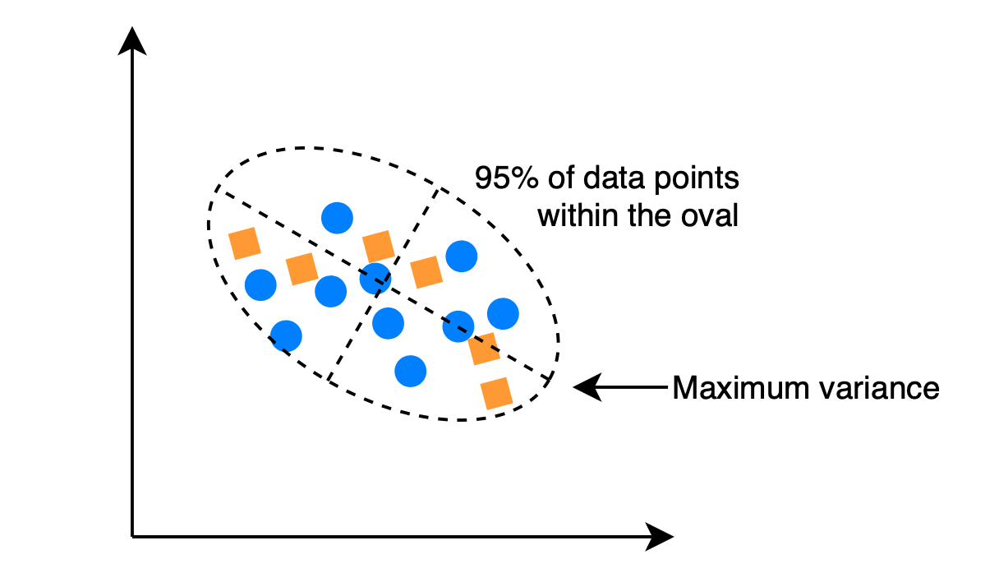
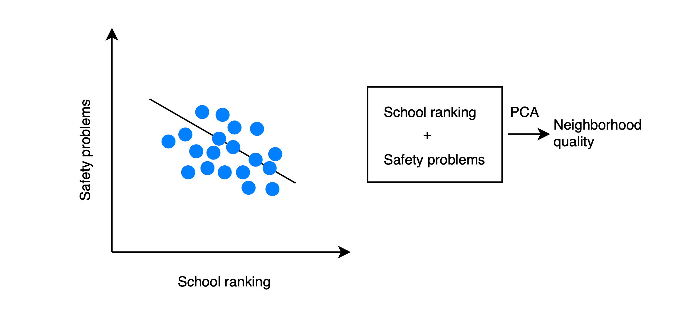
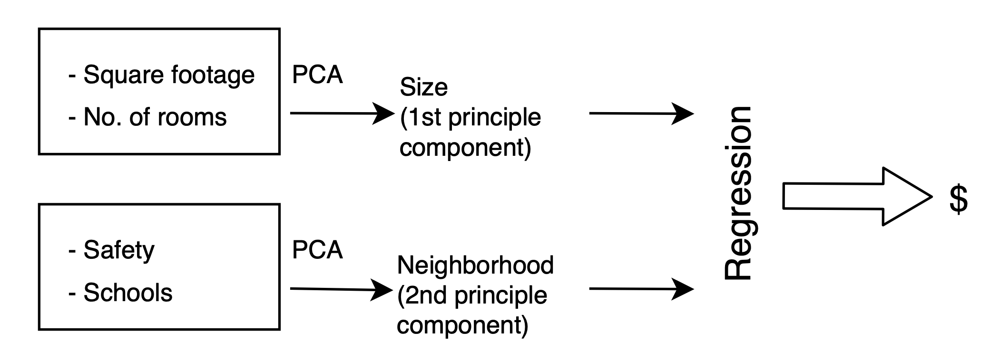
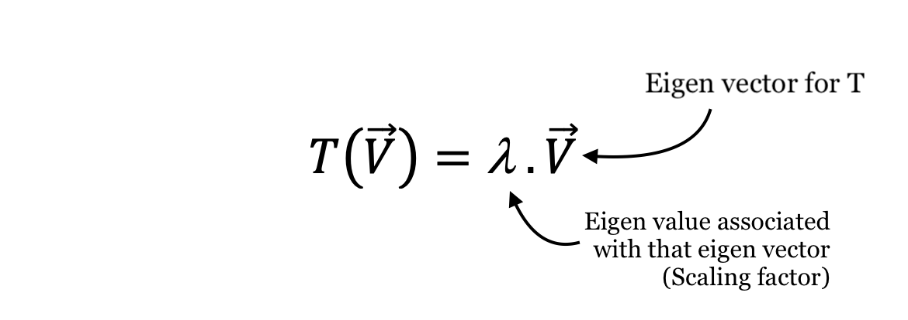

# PCA - Principal Component Analysis

PCA - Principal Component Analysis | Example code and own notes while taking the course "Intro to Machine Learning" on Udacity

## How to determine the principle component?

**Variance:** _Technical term in statistics - roughly the "spread" of a data distribution (similar to standard daviation)._

### Example:

## PCA as a General Algorithm for Feature Information

## Eigen vector & value

